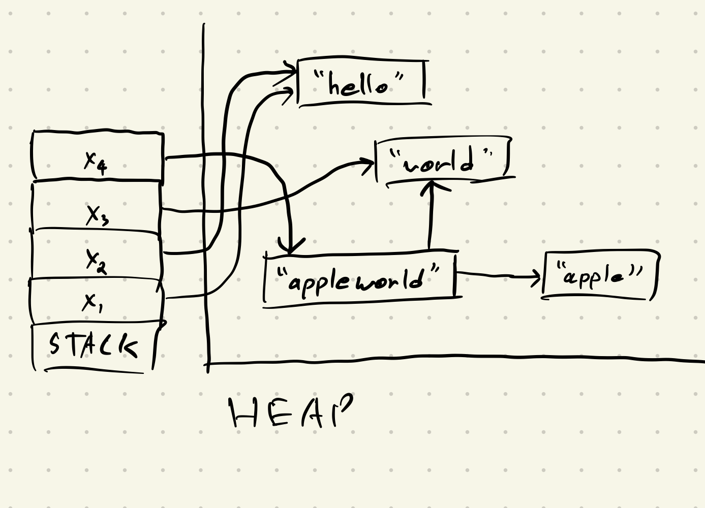

# Discussion 12 - Friday, April 19th

## Reminders

- Project 5 Updates
  - Autograder is up, due date extended two days -- **Thursday, April 25th @ 11:59 PM** ([@1789](https://piazza.com/class/lrf5qvp042i1y2/post/1789))
  - Important clarifications: [@1770](https://piazza.com/class/lrf5qvp042i1y2/post/1770)
- Quiz 4 next **Friday, April 26th**
  - Topic list TBD - see Piazza

## (More) Lambda Calculus Notes

### Bound Variable Clarification

Lambda parameters are not considered bound variables. For instance, the expression `Lx.y` has no bound variables. If we had `Lx.y x`, the only bound variable in this expression would be the `x` at the end.

## Garbage Collection Aside

In lecture, we learned about three main ways to do garbage collection:

* **Reference Counting** - Keep track of how many references point to a piece of memory, and free that memory once the counter reaches 0.
* **Mark & Sweep** - Has two phases, mark and sweep. In the mark phase, we mark all chunks of memory reachable via the stack. In the sweep phase, we go through the heap and deallocate all non-marked (non-reachable) chunks of memory.
* **Stop & Copy** - Similar to Mark & Sweep, but instead of freeing unreachable heap memory segments, we copy them to an alternate partition. Once a partition is completely freed from stack references, we swap to using that partition.

## Exercises

### Reference Counting

Consider the following stack + heap layout:

1. What would a reference counter diagram look like for this problem?
2. What would the diagram look like after the variable `x4` is popped off the stack?
   - Continue this example for `x3`, `x2`, and finally `x1`.

### Mark & Sweep

Suppose we have the following layout for the stack and heap:

1. Indicate the freed segments of memory after one pass of Mark & Sweep.
2. Remove the variable `x3` from the stack. What does the diagram look like now?
3. Remove the variables `x2` and `x1`, but keep `x3` in the stack. What does the diagram look like now?
