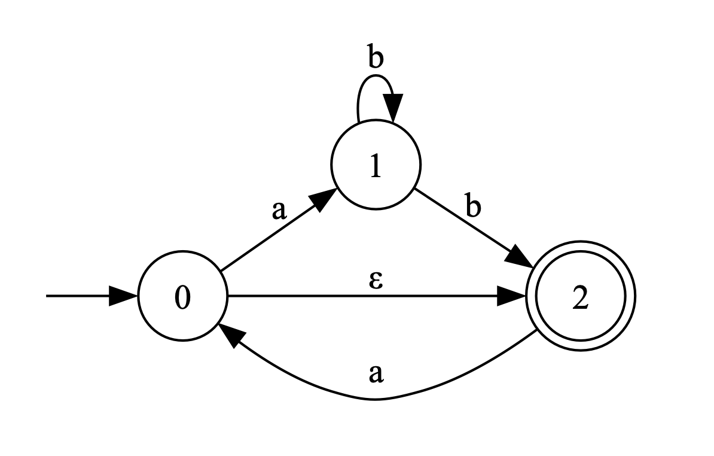
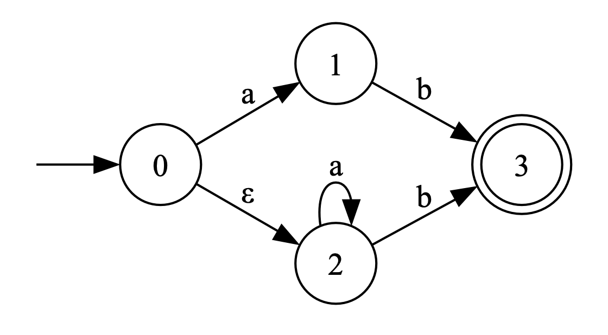
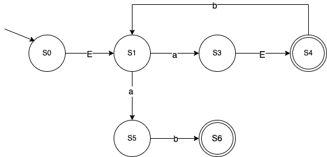
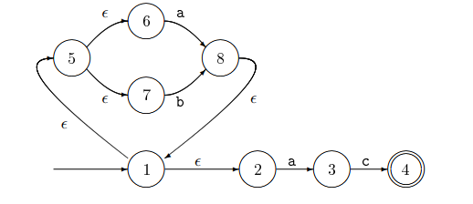

# Discussion 6 - Friday, February 30th

## Reminders

1. **Discussion Extra Credit! 🥳**
   1. This is optional
   2. More info can be found at [@695](https://piazza.com/class/lrf5qvp042i1y2/post/695)
   3. If you participate, make sure to stay back after discussion to make sure your name is recorded!
1. Exam 1 on **March 5th**
   1. Topic list: [@603](https://piazza.com/class/lrf5qvp042i1y2/post/603)
   2. TA Review Session on **March 4th @ 6PM** at **IRB0324 and Zoom** [@604](https://piazza.com/class/lrf5qvp042i1y2/post/604)
1. Project 3 due **March 15th @ 11:59 PM**
1. Office Hours Reminders: [@663](https://piazza.com/class/lrf5qvp042i1y2/post/663) and [@661](https://piazza.com/class/lrf5qvp042i1y2/post/661)
   1. Be respectful to TAs
   2. Do not camp out in OH space
   3. Be mindful of personal hygiene
1. Academic Dishonesty Reminder: [@662](https://piazza.com/class/lrf5qvp042i1y2/post/662)
   1. Do not share code or discuss implementation details
   2. Academic dishonesty can result in getting an XF in the class

## Notes

### Key differences between NFA and DFA

- All DFAs are NFAs, but not all NFAs are DFAs.
- NFA can have ε-transition(s) between states.
- NFA states can have multiple transitions going out of them using the same symbol.
- DFAs are computationally cheaper to process, but often harder to read compared to NFAs.

### Conversion Algorithm

Input: $\text{NFA}(\Sigma, Q, q_0, F_n, \delta)$ \
Output: $\text{DFA}(\Sigma, R, r_0, F_d, \delta')$ \
Let $r_0$ = $\varepsilon\text{-closure}(\delta, q_0)$, add it to $R$\
While $\exists$ an unmarked state $r \in R$:\
&nbsp;&nbsp;&nbsp;&nbsp;&nbsp;&nbsp;Mark $r$\
&nbsp;&nbsp;&nbsp;&nbsp;&nbsp;&nbsp;For each $\sigma \in \Sigma$\
&nbsp;&nbsp;&nbsp;&nbsp;&nbsp;&nbsp;&nbsp;&nbsp;&nbsp;&nbsp;&nbsp;&nbsp;Let $E = \text{move}(\delta, r, \sigma)$\
&nbsp;&nbsp;&nbsp;&nbsp;&nbsp;&nbsp;&nbsp;&nbsp;&nbsp;&nbsp;&nbsp;&nbsp;Let $e = \varepsilon\text{-closure}(\delta, E)$\
&nbsp;&nbsp;&nbsp;&nbsp;&nbsp;&nbsp;&nbsp;&nbsp;&nbsp;&nbsp;&nbsp;&nbsp;If $e \notin R$\
&nbsp;&nbsp;&nbsp;&nbsp;&nbsp;&nbsp;&nbsp;&nbsp;&nbsp;&nbsp;&nbsp;&nbsp;&nbsp;&nbsp;&nbsp;&nbsp;&nbsp;&nbsp;Let $R = R \cup \\{e\\}$\
&nbsp;&nbsp;&nbsp;&nbsp;&nbsp;&nbsp;&nbsp;&nbsp;&nbsp;&nbsp;&nbsp;&nbsp;Let $\delta' = \delta' \cup \\{ r, \sigma, e \\} $\
Let $F = \\{r \mid \exists s \in r \text{ with } s \in F_n \\}$

## Exercises

### NFA -> DFA

1. Trace through the NFA -> DFA conversion algorithm using the table method for the following NFAs:

   
   
   
   

### Regex -> NFA -> DFA

2. Consider the following regular expressions:

   ```re
   a) a*b?
   b) (b|c)+
   c) a*b?(b|c)+
   ```

   - Convert each regex to an equivalent NFA
     - Note that there are many valid NFAs
   - Convert each NFA to its equivalent DFA
   - Compare your DFA with the person next to you
     - Are they the same?

## Resources & Additional Readings

- [Fall 2023 Discussion - NFA and DFA](https://github.com/cmsc330fall23/cmsc330fall23/tree/main/discussions/d3_nfa_dfa)
- [Fall 2023 Discussion - NFA and DFA Conversion](https://github.com/cmsc330fall23/cmsc330fall23/tree/main/discussions/d4_nfa_dfa_conversion)
- [Spring 2023 Discussion - NFA and DFA](https://github.com/cmsc330-umd/spring23/tree/main/discussions/d6_nfa_dfa)
- [Slides - NFA to DFA Conversion](https://bakalian.cs.umd.edu/assets/slides/14-automata3.pdf)
