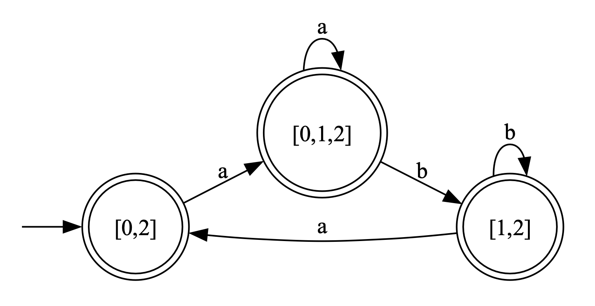
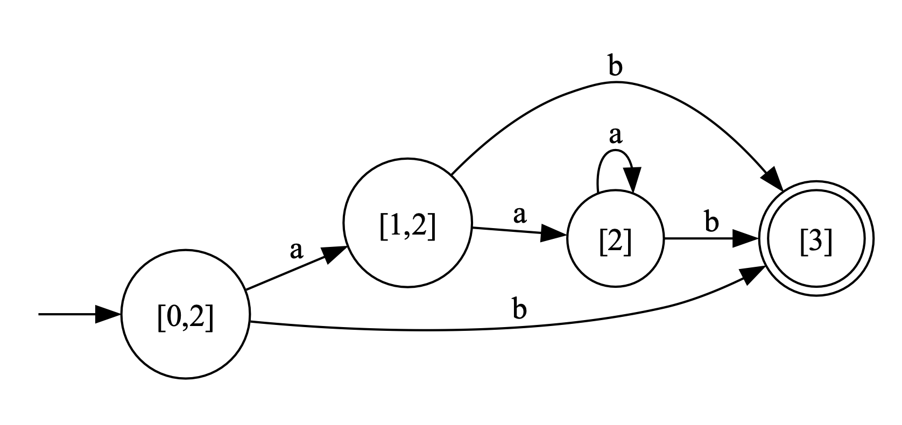
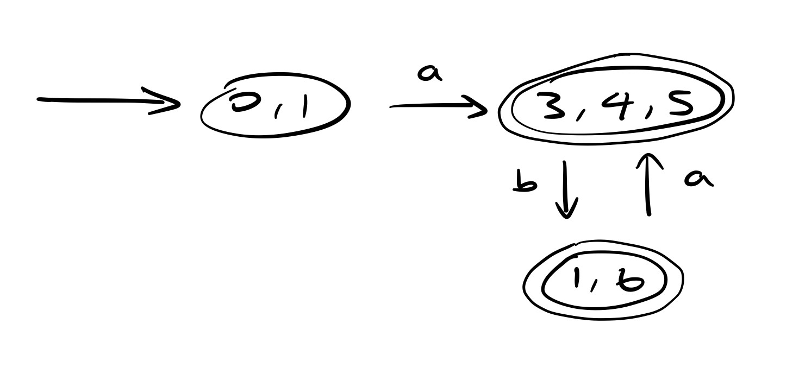
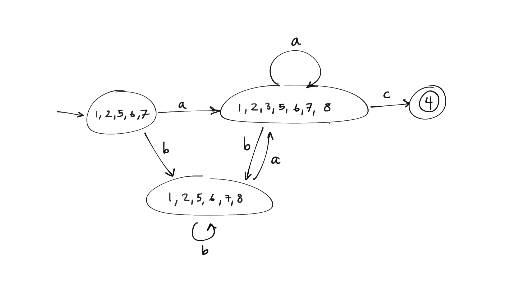
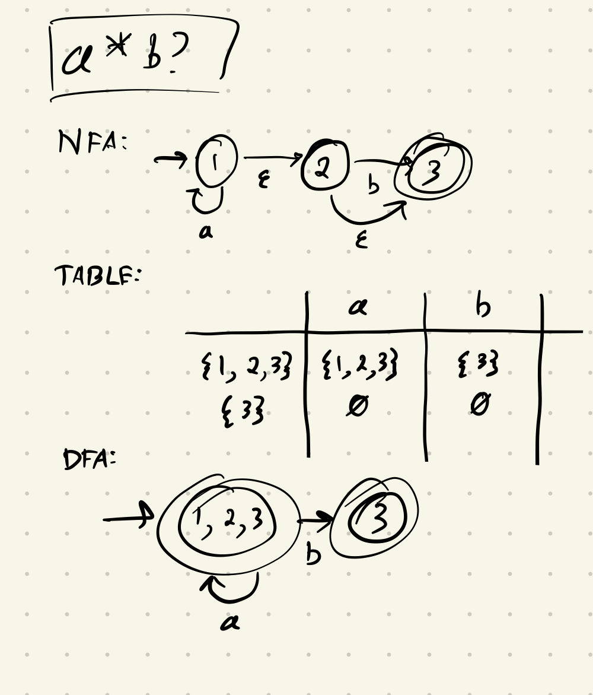
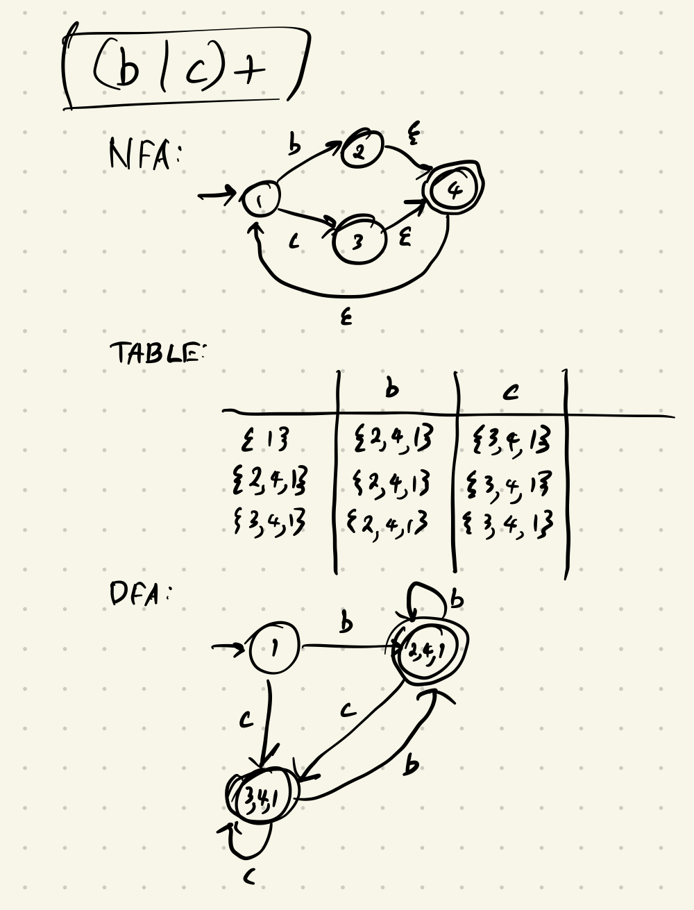
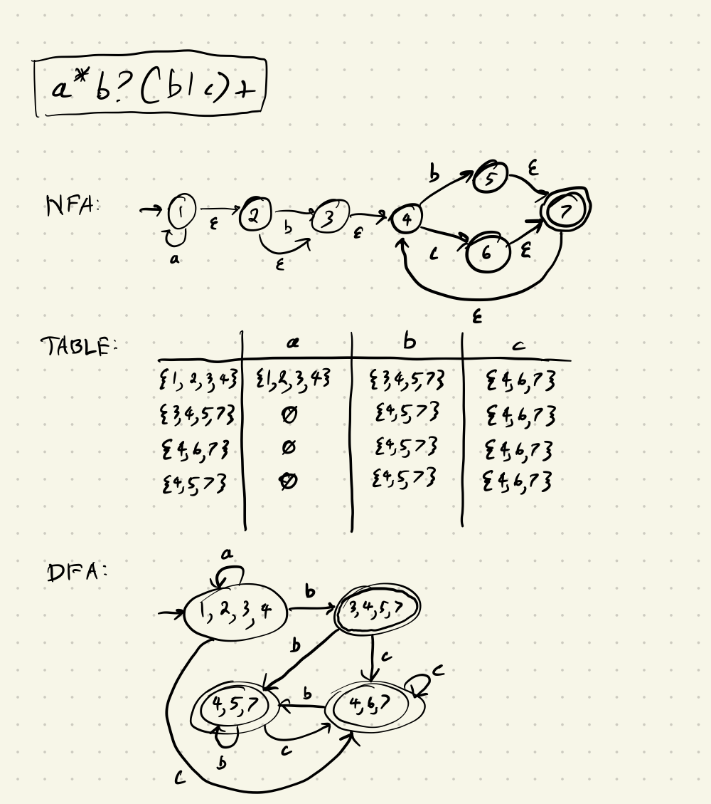

# Solutions

## 1. Trace NFA -> DFA

  
1a

  

  
1b

  

  
1c

  

  
1d

  

## 2. Regex -> NFA -> DFA

  
2a

  

  
2b

  

  
2c

  

NOTES:

- For every regex, there can be many valid NFAs. We just gave one example for each.
- Your DFAs should be the same universally, since there exists only one valid DFA for every regex / NFA.
