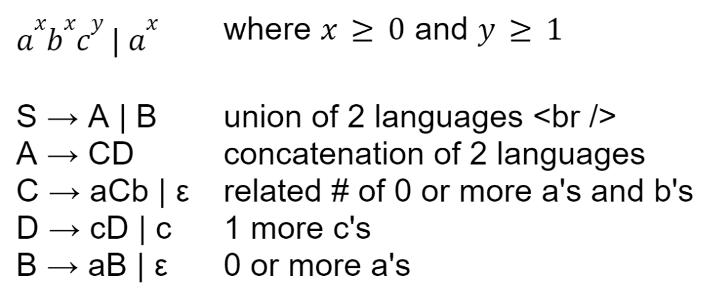
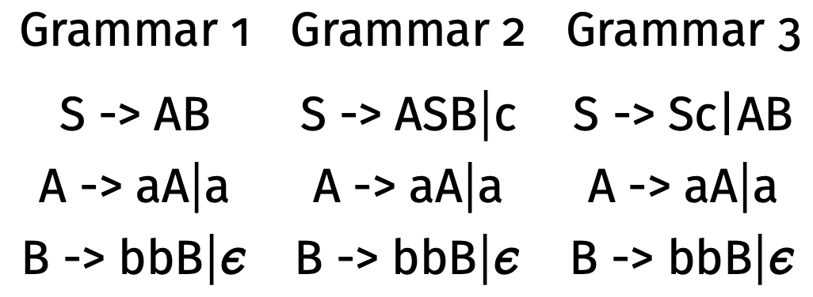

# Discussion 7 - Friday, March 8th

## Reminders

1. Project 3 due **Friday, March 15th @ 11:59 PM**
   
## Notes

### Context Free Grammars



## Exercises

### Practicing Derivations

1. Consider the following grammar:

   ```
   S -> S + S | 1 | 2 | 3
   ```

   - Write a leftmost derivation for the string: `1 + 2 + 3`

     - Start with S and use the production rules on the LEFTMOST nonterminal ONE AT A TIME. (For a rightmost derivation, use the productions on the RIGHTMOST nonterminal.)
     - ONE NONTERMINAL AT A TIME!!!! DON'T COMBINE STEPS!!!!

   - If there are 2 leftmost derivations or 2 rightmost for the same string in a grammar, what does that mean?

### More CFG Practice

2. Consider the following grammar:

   ```
   S -> aS | T
   T -> bT | U
   U -> cU | ε
   ```

   - Provide derivations for:

     - b
     - ac
     - bbc

   - What language is accepted by this grammar?

   - Create another grammar that accepts the same language.

3. Consider the following grammars:
   

   - Which grammar accepts both `"aaabb"` and `"aaabbcc"`?
   - Which grammar is ambiguous?

### CFG Construction

4. Construct a CFG that generates strings for each of the following:
   - $a^xb^y$, where $y = 2x$.
   - $a^xb^y$, where $y \ge 3x$.
5. Can we represent strings of the form $a^xb^xc^x$, where $x \ge 0$, with CFGs?
