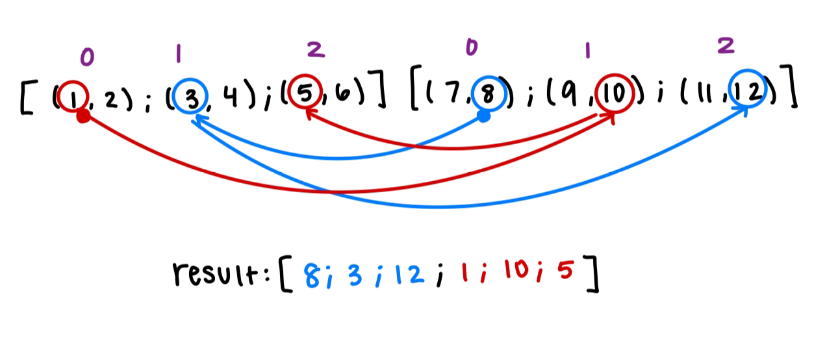

# Project 1: OCaml Warmup

Due: Sunday, February 11, 2024 at 11:59 PM (Late deadline: Monday, February 12, 2024 at 11:59 PM)

Points: 35 public/55 semipublic/10 secret. See below for definitions

**This is an individual assignment. You must work on this project alone.**

## Introduction

The goal of this project is to get you familiar with programming in OCaml. You will have to write a number of small functions, each of which is specified in four sections below.

We recommend you get started right away, going from top to bottom. The problems will get increasingly challenging, and in some cases later problems can take advantage of earlier solutions.

### Ground Rules

In your code, you may **only** use library functions found in the [`Stdlib` module](https://caml.inria.fr/pub/docs/manual-ocaml/libref/Stdlib.html) and the `@` operator. (This means you may **not** use any submodules of `Stdlib`, you may **not** use modules that link away from this page, you may **not** use the `List` module!) You may **not** use any imperative structures of OCaml such as references. 

### Testing & Submitting

The project will include the following types of tests:

- Public test code is included in your project so you can see the function calls and their output.
- Semipublic test code is hidden and the Gradescope test names will specify which functions are tested.
- Secret test code is hidden and the names will not divulge which functions are tested. However, whether you pass will still be visible on Gradescope as soon as you submit.

You should test your project in the following ways:

1. Run the public tests. These tests are the same as those on gradescope.
2. Write student tests in `test/student/student.ml` to best predict what you think the non-public tests are. You can use the public tests as a template

Relying on gradescope for testing is poor practice and not recommended. Additionally, staff cannot tell you what the semipublic and secret tests are.  

Running the public tests locally can by done using the command below:

`dune runtest -f`. This will run both public and student tests. If you want to only test a specific file, say your student tests file, run `dune runtest test/student`, replacing the path if your testing files are located in a directory elsewhere. We recommend you write student tests in `test/student/student.ml`.

Submitting to Gradescope can be done using the exact same method used for project 0. Add your changes, commit them, push them, and then run `submit` keyword.

You can interactively test your code by doing `dune utop src` (assuming you have `utop`). Then you should be able to use any of the functions located in the `src/` directory. All of your commands in `utop` need to end with two semicolons (i.e. `;;`), otherwise it will appear that your terminal is hanging.

To run a single test you need to do the following:
1. Build using `dune build`. This should create a `_build` folder or similar
2. Know where the test executable is (in this case, the publics): `ls _build/default/test/public`
3. Get the name of the test you want to run: `./_build/default/test/public/public.exe -list-test`
4. Using that name, run that test: `./_build/default/test/public/public.exe -only-test public:0:abs`

Besides the provided public tests, you will also find the file **student.ml** on `test/student/`, where you'll be able to add OUnit tests of your own. More detailed information about writing tests can be found [here](https://www.youtube.com/watch?v=C36JnAcClOQ). Here are the timestamps for the topics covered in the video:

- Installing necessary software: [00:46](https://www.youtube.com/watch?v=C36JnAcClOQ&t=46s)
- How to build and test: [01:14](https://www.youtube.com/watch?v=C36JnAcClOQ&t=74s)
- List all available tests: [04:40](https://www.youtube.com/watch?v=C36JnAcClOQ&t=280s)
- Running a specific test: [05:05](https://www.youtube.com/watch?v=C36JnAcClOQ&t=305s)
- Testing inside of utop: [09:00](https://www.youtube.com/watch?v=C36JnAcClOQ&t=540s)
- Understanding test cases: [16:00](https://www.youtube.com/watch?v=C36JnAcClOQ&t=960s)
- Writing your own test cases: [19:20](https://www.youtube.com/watch?v=C36JnAcClOQ&t=1160s)

### Project Files

The following are the relevant files for your code:

- OCaml Files
    - **src/basics.ml**: You will **write your code here**, in this file. 
    - **src/basics.mli**: This file is used to describe the signatures of all the functions in the module.  *Do not modify this file*; Gradescope will use the original version.
    - **src/funs.ml**: This file includes implementation for some useful higher order functions. These are required for Part 4, but can be used throughout the project if you wish. *Do not modify this file* Gradescope will use the original version.
    - **src/funs.mli**: This file is used to describe the signatures of all the functions in the funs.ml.  *Do not modify this file*; Gradescope will use the original version.

### Important Notes about this Project

1. Some parts of this project are additive, meaning your solutions to earlier functions can be used to aid in writing later functions. Think about this in parts 3 and 4.
2. In sections 1, 2, and 3, you may add helper functions as you wish, and these helper functions may be recursive. If you create a recursive helper function, the main function that calls the recursive helper does not also have to be recursive/have the `rec` keyword in its function header.
3. In section 4, you may create helper functions, but they cannot be recursive.
4. You may move around the function definitions. In OCaml, in order to use one function inside of another, you need to define the function before it is called. For example, if you think that a function from Part 2 can be used to help you implement a function in Part 1, you can move your implementation of the function from the Part 2 section to before the function in Part 1. As long as you still pass the tests and you haven't created a syntax error, you are fine.
5. Pay special notice to a function's type. Often times, you can lose sight of what you're trying to do if you don't remind yourself of the types of the arguments and the type of what you're trying to return.
6. You may rename arguments however you would like, but **do not modify function's name**, and **do not change the amount and order of arguments**. Doing so will cause you to fail the function's tests.

# Part 1: Non-Recursive Functions

Implement the following functions that do not require recursion. Accordingly, these functions are defined without the `rec` keyword, but **you MAY add the `rec` keyword to any of the following functions or write a recursive helper function**. Just remember that if you write a helper function, it must be defined before it is called.

#### `abs x`

- **Type**: `int -> int`
- **Description**: Returns the absolute value of `x`.
- **Restrictions**: Do not use the `abs` function from stdlib.
- **Examples**:
   ```ocaml
   abs 1 = 1
   abs (-2) = 2
   ```

#### `rev_tup tup`

- **Type**: `'a * 'b * 'c -> 'c * 'b * 'a`
- **Description**: Returns a 3-tuple in the reverse order of `tup`.
- **Examples**:
   ```ocaml
   rev_tup (1, 2, 3) = (3, 2, 1)
   rev_tup (1, 1, 1) = (1, 1, 1)
   rev_tup ("a", 1, "c") = ("c", 1, "a")
   ```

#### `is_even x`

- **Type**: `int -> bool`
- **Description**: Returns whether or not `x` is even.
- **Examples**:
  ```ocaml
  is_even 1 = false
  is_even 4 = true
  is_even (-5) = false
  ```

#### `area p q`

- **Type**: `int * int -> int * int -> int`
- **Description**: Takes in the Cartesian coordinates (2-dimensional) of any pair of opposite corners of a rectangle and returns the area of the rectangle. The sides of the rectangle are parallel to the axes.
- **Examples**:
  ```ocaml
  area (1, 1) (2, 2) = 1
  area (2, 2) (1, 1) = 1
  area (2, 1) (1, 2) = 1
  area (0, 1) (2, 3) = 4
  area (1, 1) (1, 1) = 0
  area ((-1), (-1)) (1, 1) = 4
  ```

# Part 2: Recursive Functions

Implement the following functions using recursion. You will lose points if this rule is not followed.
If you create a recursive helper function, the main function that calls the recursive helper does not have to be recursive/have the `rec` keyword in its function header.

#### `fibonacci n`

- **Type**: `int -> int`
- **Description**: Returns the `n`th term of the fibonacci sequence.
- **Assumptions**: `n` is non-negative, and we will **not** test your code for integer overflow cases.
- **Examples**:
  ```ocaml
  fibonacci 0 = 0
  fibonacci 1 = 1
  fibonacci 3 = 2
  fibonacci 6 = 8
  ```

#### `pow x p`

- **Type**: `int -> int -> int`
- **Description**: Returns `x` raised to the power `p`.
- **Assumptions**: `p` is non-negative, and we will **not** test your code for integer overflow cases.
- **Examples**:
  ```ocaml
  pow 3 1 = 3
  pow 3 2 = 9
  pow (-3) 3 = -27
  ```

#### `log x y`
- **Type**: `int -> int -> int`
- **Description**: Returns the log of `y` with base `x` rounded-down to an integer.
- **Assumptions**: You may assume the answer is non-negative, `x` >= 2, and `y` >= 1.
- **Examples**:
  ``` ocaml
  log 4 4 = 1
  log 4 16 = 2
  log 4 15 = 1
  log 4 64 = 3
  ```

#### `gcf x y`
- **Type**: `int -> int -> int`
- **Description**: Returns the greatest common factor of `x` and `y`.
- **Assumptions**: You may assume `x` >= `y` >= 0.
- **Examples**:
  ``` ocaml
  gcf 0 0 = 0
  gcf 3 0 = 3
  gcf 12 8 = 4
  gcf 24 6 = 6
  gcf 27 10 = 1
  gcf 13 13 = 13
  gcf 128 96 = 32
  ```

# Part 3: Lists

For the following functions, creating helper functions and/or using recursion is allowed but not required.

#### `reverse lst`

- **Type**: `'a list -> 'a list`
- **Description**: Returns a list with the elements of `lst` but in reverse order.
- **Examples**:
  ```ocaml
  reverse [] = []
  reverse [1] = [1]
  reverse [1; 2; 3] = [3; 2; 1]
  reverse ["a"; "b"; "c"] = ["c"; "b"; "a"]
  ```
  
#### `zip lst1 lst2`

- **Type**: `('a * 'b) list -> ('c * 'd) list -> ('a * 'b * 'c * 'd) list`
- **Description**: Merge two tuple lists, `lst1` and `lst2`, and return the result as one tuple list. Tuples will only contain two elements. The final answer will have a length equivalent to the minimum of the input lengths.
- **Examples**:
  ```ocaml
  zip [(1, 2); (3, 4); (5, 6)] [(7, 8); (9, 10); (11, 12)] = [(1, 2, 7, 8); (3, 4, 9, 10); (5, 6, 11, 12)]
  zip [] [] = []
  zip [(1, 4)] [] = []
  zip [(1, 2); (3, 4)] [(7, 8)] = [(1, 2, 7, 8)]
  ```

#### `merge lst1 lst2`

- **Type**: `'a list -> 'a list -> 'a list`
- **Description**: Merge two sorted lists, `lst1` and `lst2`, and return the result as a sorted list. 
- **Examples**:
  ```ocaml
  merge [1] [2] = [1;2]
  merge [] [] = []
  merge [1; 4] [2; 3] = [1; 2; 3; 4]
  merge [1; 4; 5] [2; 3; 6; 7; 8; 9] = [1; 2; 3; 4; 5; 6; 7; 8; 9]
  merge [1] [0] = [0; 1]
  ```

#### `is_present lst x`

- **Type**: `'a list -> 'a -> bool`
- **Description**: Returns if `x` is in `lst`
- **Examples**:
  ```ocaml
  is_present [1;2;3] 1 = true
  is_present [1;1;0] 0 = true
  is_present [2;0;2] 3 = false
  ```

#### `every_nth n lst`

- **Type**: `int -> 'a list -> 'a list`
- **Description**: Returns a list of every `n`th value from `lst`
- **Assumptions**: `n` is a positive number >= 1.
- **Examples**:
  ```ocaml
  every_nth 2 [1;2;3;4] = [2;4]
  every_nth 1 [1;2;3;4] = [1;2;3;4]
  every_nth 3 [1;2;3;4] = [3]
  ```

#### `jumping_tuples lst1 lst2`

- **Type**: `('a * 'b) list -> ('c * 'a) list -> 'a list`
- **Description**: Given two lists of equal length of two element tuples, `lst1` and `lst2`, return a list based on the following conditions:
  + The first half of the list should be the first element of every odd indexed tuple in `lst1`, and the second element of every even indexed tuple in `lst2`, interwoven together (starting from index 0). 
  + The second half of the list should be the the first element of every even indexed tuple in `lst1`, and the second element of every odd indexed tuple in `lst2`, interwoven together (starting from index 0). 
- **Assumptions**: `lst1` and `lst2` are the same length.

Consider using functions you have written above as helpers.

- **Examples**:
  ```ocaml
  jumping_tuples [(1, 2); (3, 4); (5, 6)] [(7, 8); (9, 10); (11, 12)] = [8; 3; 12; 1; 10; 5]
  jumping_tuples [(true,"a"); (false,"b")] [(100, false); (428, true)] = [false; false; true; true]
  jumping_tuples [("first", "second"); ("third", "fourth")] [("fifth", "sixth"); ("seventh", "eighth")] = ["sixth"; "third"; "first"; "eighth"]
  jumping_tuples [] [] = []
  ```

Here's an image that shows the jumping logic for the first example from above:


#### `max_func_chain init funcs`
- **Type**: `'a -> ('a -> 'a) list -> 'a`
- **Description**: This function takes in an initial value and a list of functions, and decides to either apply each function or not to maximize the final return value. For example, if we have a list of functions:
`[funcA; funcB; funcC]` and an initial value `x`, then we take the maximum value
of
   + `x`
   + `funcA(x)`
   + `funcB(funcA(x))`
   + `funcC(funcB(funcA(x)))`
   + `funcC(funcA(x))`
   + `funcB(x)`
   + `funcC(funcB(x))`
   + `funcC(x)`
- **Examples**:
  ```ocaml
  max_func_chain 2 [(fun x -> x + 6)] = 8
  max_func_chain 2 [(fun x -> x + 4); (fun x -> x * 4)] = 24
  max_func_chain 4 [(fun x -> x - 2); (fun x -> x + 10)] = 14
  max_func_chain 0 [(fun x -> x - 1); (fun x -> x * -500); (fun x -> x + 1)] = 501
  max_func_chain "hello" [(fun x -> x ^ "1"); (fun x -> x ^ "2"); (fun x -> x ^ "3")] = "hello3"
  ```

# Part 4: Higher Order Functions

Write the following functions using `map`, `fold`, or `fold_right` as defined in the file `funs.ml`. You **must** use `map`, `fold`, or `fold_right` to complete these functions, so none of the functions in Part 4 may be defined using the `rec` keyword. 
- You also **may not** create *recursive helper functions*, You will lose points if this rule is not followed. 
- You **may** create *non-recursive helper functions* as you see fit for all of part 4.

#### `is_there lst x`

- **Type**: `'a list -> 'a -> bool`
- **Description**: returns a bool of `x` is in `lst`
- **Examples**:
  ```ocaml
  is_there [1;2;3] 1 = true
  is_there [1;1;0] 0 = true
  is_there [2;0;2] 3 = false
  ```

#### `count_occ lst target`

- **Type**: `'a list -> 'a -> int`
- **Description**: Returns how many elements in `lst` are equal to `target`.
- **Examples**:
  ```ocaml
  count_occ [] 1 = 0
  count_occ [1] 1 = 1
  count_occ [1; 2; 2; 1; 3] 1 = 2
  ```

#### `uniq lst`

- **Type**: `'a list -> 'a list`
- **Description**: Given a list, returns a list with all duplicate elements removed. *Order does not matter, in the output list.*
- **Examples**:
  ```ocaml
  uniq [] = []
  uniq [1] = [1]
  uniq [1; 2; 2; 1; 3] = [2; 1; 3]
  ```

#### `every_xth x lst`

- **Type**: `int -> 'a list -> 'a list`
- **Description**: Returns a list of every `x`th value from `lst`
- **Examples**:
  ```ocaml
  every_xth 2 [1;2;3;4] = [2;4]
  every_xth 1 [1;2;3;4] = [1;2;3;4]
  every_xth 3 [1;2;3;4] = [3]
  ```

## Academic Integrity

Please **carefully read** the academic honesty section of the course syllabus. **Any evidence** of impermissible cooperation on projects, use of disallowed materials or resources, or unauthorized use of computer accounts, **will be** submitted to the Student Honor Council, which could result in an XF for the course, or suspension or expulsion from the University. This includes posting this project to GitHub after the course is over. Be sure you understand what you are and what you are not permitted to do in regards to academic integrity when it comes to project assignments. These policies apply to all students, and the Student Honor Council does not consider lack of knowledge of the policies to be a defense for violating them. Full information is found in the course syllabus, which you should review before starting.
