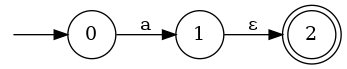
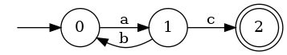

# Project 3: Regular Expression Engine

Due: Friday, March 15th 11:59 PM (Late: Saturday, March 16th 11:59 PM)

Points: 35 public, 65 semipublic

**This is an individual assignment. You must work on this project alone.**

## Overview

In this project, you will implement algorithms to work with NFAs, DFAs, and regular expressions. In particular, you will implement `accept` to see whether a string is matched by an NFA; `nfa_to_dfa` to convert an NFA to a DFA using the subset construction; `regex_to_nfa` to convert a regular expression to an NFA. You will also implement several other helper functions to assist in these tasks.

The project is broken into three parts: algorithms on NFAs; converting a DFA to an NFA; and converting/working with Regular Expressions. NFAs and DFAs are implemented in `src/nfa.ml`, and regexes in `src/regexp.ml`.

In class, we implemented a Regular Expression Interpreter through a series of reductions. First, we converted the RegExp to an NFA, then the NFA to a DFA, and then ran the DFA on an input string to see if the string was accepted. This project will not follow that sequence exactly but will allow you to work with the reductions so you understand each step in the sequence.

Here's how the parts can be assembled into an Interpreter. In Part I, you'll simulate an NFA. You can do that directly, or you can use Part II to convert to a DFA and then assume you have a DFA to simulate. In Part II, you'll implement an NFA to DFA converter. In Part III, you'll convert a RegExp to an NFA. You can put these parts together to create an Interpreter: Input a RegExp to Part III to create an NFA, and then input that NFA and a string to Part I to simulate the resulting NFA. Or, input that NFA to Part II to get a DFA, then since the class of DFAs is a subset of NFAs, input that DFA to Part I to simulate it. You aren't required to create these workflows, as we'll test each part independently, but you can experiment with them. (Note that the same Ocaml type, `nfa_t`, is used for both NFAs and DFAs in this project, so the function to convert an NFA to a DFA takes and returns `nfa_t`.)

### Ground Rules
This is NOT a pair project. You must work on this project alone as with most other CS projects. See the [Academic Integrity](#academic-integrity) section for more information. In your code, you **may** use any non-imperative standard library functions (with the exception of printing, see below), but the ones that will be useful to you will be found in the [`Stdlib`][pervasives doc] and [`List`][list doc]. The **only imperative feature you may use is the provided `fresh` function** in Part 3. **You will receive a 0 for any functions using restricted features - we will be checking your code! This includes for loops, while loops, and references.**

Several helper functions have been provided for you, as detailed at the end of this document. We have also provided a `Sets` module that correctly implements the functions for a functional [Set module][sets]. **Note:** the functions in the `Sets` module assume that the inputs are valid sets (i.e., they do not contain duplicates).  They will have undefined behavior if you try to give them inputs that do not meet this requirement (such as `[1; 2; 2; 3]`). You can convert an arbitrary list to a valid set with `List.sort_uniq Stdlib.compare your_list`.

### Testing

The procedure for testing this project is the same as the previous project. `dune` handles the majority of the work but, an environment variable must be set for `dune` to know where to find the precompiled binary files distributed with the project.

For this project, you must have OCaml version 4.13.0. or newer To make sure you have the correct version of OCaml, run `ocaml --version`. If your version of OCaml is not 4.14.0, refer to the project 0 instructions to update your version.

Public and student tests can be run using the same `dune` command that you used in the previous projects but, you may need to set the environment variable `OCAMLPATH` before running the command. The full command is now `env OCAMLPATH=dep dune runtest -f`. Setting `OCAMLPATH` tells `dune` where it can find the functions over sets that we have provided. 

For testing your regular expressions and `nfa_to_dfa`, we've provided a script: `viz.sh`. When you run this command, it will read a regular expression from standard in, compose an NFA from it, and export that NFA to Graphviz before rendering to a PNG. For this target to work, however, you must install Graphviz.

You are not required to do this, but it may be helpful in debugging your code. Once you've performed these steps, you can run the visualizer as follows:

1. Run the shell script `./viz.sh` or the command `env OCAMLPATH=dep dune exec bin/viz.bc` to open the input shell.
2. The shell will ask for a regular expression. Type without spaces and using only the constructs supported by this project.
3. Select if you want to convert the NFA to a DFA (with your conversion function) before visualizing.
4. You should be notified that the image has been successfully generated and put in `output.png`.
5. Use an image viewer of choice to open `output.png` and see the visual representation of your generated NFA.

### Submitting
Submitting to Gradescope can be done using the exact same method used for project 0. Add your changes, commit them, push them, and then enter the submit command.

### Academic Integrity

Please **carefully read** the academic honesty section of the course syllabus. **Any evidence** of impermissible cooperation on projects, use of disallowed materials or resources, or unauthorized use of computer accounts, **will** be submitted to the Student Honor Council, which could result in an XF for the course, or suspension or expulsion from the University. Be sure you understand what you are and what you are not permitted to do in regards to academic integrity when it comes to project assignments. These policies apply to all students, and the Student Honor Council does not consider lack of knowledge of the policies to be a defense for violating them. Full information is found in the course syllabus, which you should review before starting.

## Part 1: NFAs

This first part of the project asks you to implement some functions for working with NFAs. In particular, you will be asked to implement the *move* and *epsilon closure* functions [described in class][lecture notes]; these will be handy for Part 2. You will also implement an `accept` function to determine whether a string is matched by a given NFA; both *move* and *epsilon closure* may be handy here, too.

### NFA Types

Before starting, you'll want to familiarize yourself with the types you will be working with.

The type `nfa_t` is the type representing NFAs. It is modeled after the formal definition of an NFA, a 5-tuple (Σ, Q, q0, F, δ) where:

1. Σ is a finite alphabet,
2. Q is a finite set of states,
3. q0 ∈ Q is the start state,
4. F ⊆ Q is the set of accept states, and
5. δ : Q × (Σ ∪ {ε}) → 𝒫(Q) is the transition function (𝒫(Q) represents the powerset of Q).

In OCaml, you can use a record to introduce a new type. They're kind of like structs in C. A record can have fields, which each have their own types.
The syntax for declaring a record type is shown below.

```ocaml
type <record-name> =
    { <field> : <type>;
      <field> : <type>;
      ...
    }
```

For instance, we can define the record pizza:

```ocaml
type pizza =
    { topping : string;
      cost : int;
    }
```

We can access a record's field through the dot notation:

```ocaml
let ex = {topping = "pepperoni"; cost = 10;};;
ex.cost;;
```

This would return 10.

The resource [here](https://courses.cs.cornell.edu/cs3110/2021sp/textbook/data/records.html) provides more information on records.

We translate this definition into OCaml in a straightforward way using record syntax:

```ocaml
type ('q, 's) transition = 'q * 's option * 'q
type ('q, 's) nfa_t = {
    sigma : 's list;
    qs : 'q list;
    q0 : 'q;
    fs : 'q list;
    delta : ('q, 's) transition list;
}
```

Notice the types are parametric with states of type `'q` and symbols of type `'s`.

The type `transition` represents NFA transitions. For example:

```ocaml
let t1 = (0, Some 'c', 1)  (* Transition from state 0 to state 1 on character 'c' *)
let t2 = (1, None, 0)      (* Transition from state 1 to state 0 on epsilon *)
```

Notice that we use `'s option` to represent the transition's character. This is so `None` represents epsilon, and `Some 'a'` represents a transition on the character `a`.

While the formal definition of a transition is a function which maps a state and character to a set of states, we will define transitions as 3-tuples so that each edge in the NFA will correspond to a single transition in the list of transitions. This will make the syntax for defining NFAs cleaner, and allows for a one-to-one mapping between elements of the transition list and edges in the NFA graph.

An example NFA would be:

```ocaml
let nfa_ex = {
    sigma = ['a'];
    qs = [0; 1; 2];
    q0 = 0;
    fs = [2];
    delta = [(0, Some 'a', 1); (1, None, 2)]
}
```

This looks like:



Here is a DFA:

```ocaml
let dfa_ex = {
    sigma = ['a'; 'b'; 'c'];
    qs = [0; 1; 2];
    q0 = 0;
    fs = [2];
    delta = [(0, Some 'a', 1); (1, Some 'b', 0); (1, Some 'c', 2)]
}
```

This looks like:



### Functions

Here are the functions you must implement:

#### `move nfa qs s`

- **Type**: `('q, 's) nfa_t -> 'q list -> 's option -> 'q list`
- **Description**: This function takes as input an NFA `nfa`, a set of initial states `qs`, and a symbol option `s`. The output will be the set of states (represented by a list) that the NFA might be in after starting from any state in `qs` and making one transition on the symbol `s`. If the symbol is not in the alphabet `sigma`, then return an empty list. You can assume the initial states are valid (ie a subset of the NFA's states). `s` may be None, if this is the case, `move` should output the result of making **exactly one epsilon transition*.

- **Examples**:

  ```ocaml
  move nfa_ex [0] (Some 'a') = [1] (* nfa_ex is the NFA defined above *)
  move nfa_ex [1] (Some 'a') = []
  move nfa_ex [2] (Some 'a') = []
  move nfa_ex [0;1] (Some 'a')  = [1]
  move nfa_ex [1] None = [2]
  ```

- **Explanation**:
  1. Move on `nfa_ex` from `0` with `Some a` returns `[1]` since from 0 to 1 there is a transition with character `a`.
  2. Move on `nfa_ex` from `1` with `Some a` returns `[]` since from 1 there is no transition with character `a`.
  3. Move on `nfa_ex` from `2` with `Some a` returns `[]` since from 2 there is no transition with character `a`.
  4. Move on `nfa_ex` from `0` and `1` with `Some a` returns `[1]` since from 0 to 1 there is a transition with character `a` but from 1 there is no transition with character `a`.
  5. Move on `nfa_ex` from `1` with `None` returns `[2]` since from 1 to 2 there is an epsilon transition.

#### `e_closure nfa qs`

- **Type**: `('q, 's) nfa_t -> 'q list -> 'q list`
- **Description**: This function takes as input an NFA `nfa` and a set of initial states `qs`. It outputs a set of states that the NFA might be in after making zero or more epsilon transitions from any state in `qs`. You can assume the initial states are valid (ie a subset of the NFA's states).
- **Examples**:

  ```ocaml
  e_closure nfa_ex [0] = [0]
  e_closure nfa_ex [1] = [1;2]
  e_closure nfa_ex [2]  = [2]
  e_closure nfa_ex [0;1] = [0;1;2]
  ```

- **Explanation**:
  1. e_closure on `nfa_ex` from `0` returns `[0]` since the only state you can get to from `0` epsilon transitions is `0`. (there is always an implicit epsilon transition from a state to itself)
  2. e_closure on `nfa_ex` from `1` returns `[1;2]` since from `1` you can get to `1` and `2` with epsilon transitions.
  3. e_closure on `nfa_ex` from `2` returns `[2]` since there  the only state you can get to is `2`.
  4. e_closure on `nfa_ex` from `0` and `1` returns `[0;1;2]` since from `0` you can only get to `0`, and from `1` you can get to `1` and `2`, and from `2` you can only get to `2`.

#### `accept nfa s`

- **Type**: `('q, char) nfa_t -> string -> bool`
- **Description**: This function takes an NFA `nfa` and a string `s`, and returns `true` iff the NFA accepts the string.
- **Examples**:

  ```ocaml
  accept dfa_ex "" = false  (* dfa_ex is the NFA defined above *)
  accept dfa_ex "ac" = true
  accept dfa_ex "abc" = false
  accept dfa_ex "abac" = true
  ```

- **Explanation**:
  1. accept on `dfa_ex` with the string "" returns `false` because initially we are at our start state 0 and there are no characters to exhaust and we are not in a final state.
  2. accept on `dfa_ex` with the string "ac" returns `true` because from 0 to 1 there is an 'a' transition and from 1 to 2 there is a 'c' transition and now that the string is empty and we are in a final state, the nfa accepts "ac".
  3. accept on `dfa_ex` with the string "abc" returns `false` because from 0 to 1 there is an 'a' transition but then to use the 'b' we go back from 1 to 0 and we are stuck because we need a 'c' transition yet there is only an 'a' transition.
  4. accept on `dfa_ex` with the string "abac" returns `true` because from 0 to 1 there is an 'a' transition but then to use the 'b' we go back from 1 to 0 and then we take an 'a' transition to go to state 1 again and then finally from 1 to 2 we exhaust our last character 'c' to make it to our final state. Since we are in a final state, the nfa accepts "abac".

## Part 2: DFAs

In this part, our goal is to implement the `nfa_to_dfa` function. It uses the subset construction to convert an NFA to a DFA. For help with understanding Subset Construction you can look at the [lecture notes][lecture notes]. We recommend you implement the `move` and `e_closure` parts of Part 1 before starting Part 2 since they are used in the subset construction.

Remember that every DFA is also an NFA, but the reverse is not true. The subset construction converts an NFA to a DFA by grouping together multiple NFA states into a single DFA state. Hence, our DFA type is `('q list, 's) nfa_t`. Notice that our
states are now sets of states from the NFA. The description will use "dfa state" to mean a set of states from the corresponding NFA.

To write `nfa_to_dfa`, we will  write some helpers. These helpers follow the NFA to DFA conversion method discussed in lecture. We will test these functions individually in the public tests to help you track your progress and find bugs. Remember, you can always add more student tests in `test/student.ml`! 

**Hint**: `new_states`, `new_trans`, and `new_finals` can all be implemented in one line!

### `new_states nfa qs`

- **Type**: `('q, 's) nfa_t -> 'q list -> 'q list list`
- **Description**: The inputs are an NFA and a list of states. The output is a list of state lists. Each element in the returned list is the list you can get to by starting from any state in the inputted list and moving on one character of the alphabet (`sigma`) followed by any number of epsilon transitions. This may seem a little confusing at first, so make sure you look at the examples below!
- **Examples**:

  ```ocaml
  new_states nfa_ex [0] = [[1; 2]]    
  new_states dfa_ex [0; 1] = [[1]; [0]; [2]]
  new_states dfa_ex [1; 2] = [[]; [0]; [2]]
  ```
- **Explanation**:
  1. Starting from state 0 in nfa_ex, we can move only to state 1 on 'a' and then from state 1 to state 2 on epsilon, so we have [1; 2]. 'a' is the only character in the alphabet. So, we return [[1;2]].
  2. Starting from either state 0 or state 1 in dfa_ex, we want to see where we can move to. If we start at 0, we can move to 1 on 'a', and if we start at 1, there isn't an 'a' transition. There are no states we can move to from 1 via epsilons (because it's a DFA), so we have [1]. Then, starting again from either state 0 or state 1, we can move to 0 on 'b' from 1, and there isn't a 'b' transition from 0 to another state. There are no states we can move to from 0 via epsilons, so we have [0]. Then, starting again from either state 0 or state 1, we can move to 2 on 'c' from 1, and there isn't a 'c' transition from 0 to another state. There are no states we can move to from 2 via epsilons, so we have [2]. So, our overall returned list is [[1]; [0]; [2]].
  3. Starting from either state 1 or state 2 in dfa_ex, there is no 'a' transition that starts from either state 1 or state 2. So, we have []. Then, starting again from either state 1 or state 2, we can move to 0 on 'b' from 1, and there isn't a 'b' transition from 2 to another state. There are no states we can move to from 0 via epsilons (because it's a DFA), so we have [0]. Then, starting again from either state 1 or state 2, we can move to state 2 on 'c' from 1, and there isn't a 'c' transition from 2 to another state. There are no states we can move to from 2 via epsilons, so we have [2]. So, our overall list is [[]; [0]; [2]].

### `new_trans nfa qs`

- **Type**: `('q, 's) nfa_t -> 'q list -> ('q list, 's) transition list`
- **Description**: The inputs are an NFA and a list of states. The output is a transition list. Each element in the returned list is a tuple in the form of (src, char, dest), where dest is the list of states you can get to after starting from any state in the inputted list and moving on one character of the alphabet (`sigma`), followed by any number of epsilon transitions. This may seem a little confusing at first, so make sure you look at the examples below!
- **Examples**:

  ```ocaml
  new_trans nfa_ex [0] = [([0], Some 'a', [1; 2])]
  new_trans dfa_ex [0; 1] = [([0; 1], Some 'a', [1]); ([0; 1], Some 'b', [0]); ([0; 1], Some 'c', [2])]
  new_trans dfa_ex [1; 2] = [([1; 2], Some 'a', []); ([1; 2], Some 'b', [0]); ([1; 2], Some 'c', [2])]
  ```
 **Explanation**:
  1. Starting from state 0 in nfa_ex, we can move only to state 1 on 'a' and then from state 1 to state 2 on epsilon, which gives us the tuple ([0], Some 'a', [1; 2]). 'a' is the only character in the alphabet. So, we return [([0], Some 'a', [1; 2])].
  2. Starting from either state 0 or state 1 in dfa_ex, we want to see where we can move to. If we start at 0, we can move to 1 on 'a', and if we start at 1, there isn't an 'a' transition. There are no states we can move to from 1 via epsilons (because it's a DFA), so we have the tuple ([0; 1], Some 'a', [1]). Then, starting again from either state 0 or state 1, we can move to 0 on 'b' from 1, and there isn't a 'b' transition from 0 to another state. There are no states we can move to from 0 via epsilons, so we have the tuple ([0; 1], Some 'b', [0]). Then, starting again from either state 0 or state 1, we can move to 2 on 'c' from 1, and there isn't a 'c' transition from 0 to another state. There are no states we can move to from 2 via epsilons, so we have the tuple ([0; 1], Some 'c', [2]). So, our overall returned list is [([0; 1], Some 'a', [1]); ([0; 1], Some 'b', [0]); ([0; 1], Some 'c', [2])].
  3. Starting from either state 1 or state 2 in dfa_ex, there is no 'a' transition that starts from either state 1 or state 2. So, we have ([1;2], Some 'a', []). Then, starting again from either state 1 or state 2, we can move to 0 on 'b' from 1, and there isn't a 'b' transition from 2 to another state. There are no states we can move to from 0 via epsilons (because it's a DFA), so we have ([1;2], Some 'b', [0]). Then, starting again from either state 1 or state 2, we can move to state 2 on 'c' from 1, and there isn't a 'c' transition from 2 to another state. There are no states we can move to from 2 via epsilons, so we have ([1;2], Some 'c', [2]). So, our overall returned list is [([1;2], Some 'a', []); ([1;2], Some 'b', [0]); ([1;2], Some 'c', [2])].

### `new_finals nfa qs`

- **Type**: `('q, 's) nfa_t -> 'q list -> 'q list list`
- **Description**: Given an NFA and a list of states, return `[qs]` if an element of `qs` is a final state in the given NFA. Return `[]` otherwise.
- **Examples**:

  ```ocaml
  new_finals dfa_ex [0; 1; 2] = [[0; 1; 2]]
  new_finals dfa_ex [0; 1] = []
  ```

### `nfa_to_dfa nfa`

- **Type**: `('q, 's) nfa_t -> ('q list, 's) nfa_t`
- **Description**: This function takes as input an NFA and converts it to an equivalent DFA. The language recognized by an NFA is invariant under `nfa_to_dfa`. In other words, for all NFAs `nfa` and for all strings `s`, `accept nfa s = accept (nfa_to_dfa nfa) s`.

### Suggestions

The `nfa_to_dfa` algorithm is pretty substantial. While you are free to design it in whatever manner you like (referring to the [lecture slides][lecture notes] for assistance), we suggest you consider writing a helper function `nfa_to_dfa_step`. Efficiency matters here, and if your code times out, it will fail the tests. Try to minimize the calls to `List` and `Set` (i.e. iterate less) to prevent this. We time out at 5 minutes.

#### `nfa_to_dfa_step nfa dfa wrk`

- **Optional, Ungraded**: Skip implementing the `nfa_to_dfa_step` function if you feel you have a better approach.
- **Type**: `('q, 's) nfa_t -> ('q list, 's) nfa_t -> 'q list list -> ('q list, 's) nfa_t`
- **Description**: First, let's take a look at what is being passed into the function for clarity:

  *Parameters*
  - `nfa`: the NFA to be converted into a DFA.
  - `dfa`: the DFA to be created from the NFA. This will act as the accumulator in the function. Each time this function is called, the DFA should be updated based on the worklist.
  - `wrk`: a list of unvisited states.

  Given an NFA, a partial DFA, and a worklist, this function will compute one step of the subset construction algorithm. This means that we take an unvisited DFA state from the worklist and add it to our DFA that we are creating (updating the list of all states, transitions, and final states appropriately). Our worklist is then updated for the next iteration by removing the newly processed state. You will want to use the previous three functions as helpers. They can be used to update the DFA's states, transitions, and final states.


## Part 3: Regular Expressions

For the last part of the project, you will implement code to convert a regular expression to an NFA. (Then, you could use your `NFA` module developed above to match particular strings.) The `Regexp` module represents a regular expression with the type `regexp_t`:

```ocaml
type regexp_t =
  | Empty_String
  | Char of char
  | Union of regexp_t * regexp_t
  | Concat of regexp_t * regexp_t
  | Star of regexp_t
```

This datatype represents regular expressions as follows:

- `Empty_String` represents the regular expression recognizing the empty string (not the empty set!). Formally, the empty string can be represented as `epsilon`.
- `Char c` represents the regular expression that accepts the single character c. Written as a formal regular expression, this would be `c`.
- `Union (r1, r2)` represents the regular expression that is the union of r1 and r2. For example, `Union(Char 'a', Char'b')` is the same as the formal regular expression `a|b`.
- `Concat (r1, r2)` represents the concatenation of r1 followed by r2. For example, `Concat(Char 'a', Char 'b')` is the same as the formal regular expression `ab`.
- `Star r` represents the Kleene closure of regular expression r. For example, `Star (Union (Char 'a', Char 'b'))` is the same as the formal regular expression `(a|b)*`.

Here is the function you must implement:

### `regexp_to_nfa regexp`

- **Type**: `regexp_t -> nfa_t`
- **Description**: This function takes a regexp and returns an NFA that accepts the same language as the regular expression. Notice that as long as your NFA accepts the correct language, the structure of the NFA does not matter since the NFA produced will only be tested to see which strings it accepts. 

## Provided Functions

The rest of these functions are implemented for you as helpers. Use them as you like; you may modify them as you wish.

### `explode s`

- **Type**: `string -> char list`
- **Description**: This function takes a string and converts it into a character list. The following function may be helpful when writing `accept` in Part 1.

### `fresh`

- **Type**: `unit -> int`
- **Description**: This function takes in type `unit` as an argument (similar to Null). This function uses imperative OCaml to return an `int` value that has not been used before by using a reference to a counter. You might find this helpful for implementing  `regexp_to_nfa`.
- **Examples**:

  ```ocaml
  fresh () = 1
  fresh () = 2
  fresh () = 3
  ...
  ```

The following functions are useful for writing tests.

### `string_to_nfa s`

- **Type**: `string -> nfa`
- **Description**: This function takes a string for a regular expression, parses the string, converts it into a regexp, and transforms it to an nfa, using your `regexp_to_nfa` function. As such, for this function to work, your `regexp_to_nfa` function must be working. In the starter files, we have provided the function `string_to_regexp` that parses strings into `regexp` values, described next.

### `string_to_regexp s`

- **Type**: `string -> regexp`
- **Description**: This function takes a string for a regular expression, parses the string, and outputs its equivalent regexp. If the parser determines that the regular expression has illegal syntax, it will raise an IllegalExpression exception.
- **Examples**:

  ```ocaml
  string_to_regexp "a" = Char 'a'
  string_to_regexp "(a|b)" = Union (Char 'a', Char 'b')
  string_to_regexp "ab" = Concat(Char 'a', Char 'b')
  string_to_regexp "aab" = Concat(Char 'a',Concat(Char 'a', Char 'b'))
  string_to_regexp "(a|E)*" = Star(Union(Char 'a',Empty_String))
  string_to_regexp "(a|E)*(a|b)" = Concat(Star(Union(Char 'a',Empty_String)),Union(Char 'a',Char 'b'))
  ```

  In a call to `string_to_regexp s` the string `s` may contain only parentheses, |, \*, a-z (lowercase), and E (for epsilon). A grammatically ill-formed string will result in `IllegalExpression` being thrown. Note that the precedence for regular expression operators is as follows, from highest(1) to lowest(4):
  
  Precedence | Operator | Description
  ---------- | -------- | -----------
  1 | `()` | parentheses
  2 | `*` | closure
  3 |  | concatenation
  4 | `|` | union
  
  Also, note that all the binary operators are **right associative**.


[list doc]: https://v2.ocaml.org/api/List.html
[pervasives doc]: https://v2.ocaml.org/api/Stdlib.html
[lecture notes]: https://bakalian.cs.umd.edu/330/schedule
[fsm notes]: https://bakalian.cs.umd.edu/assets/notes/fa.pdf
[sets]: ./SETS.md
