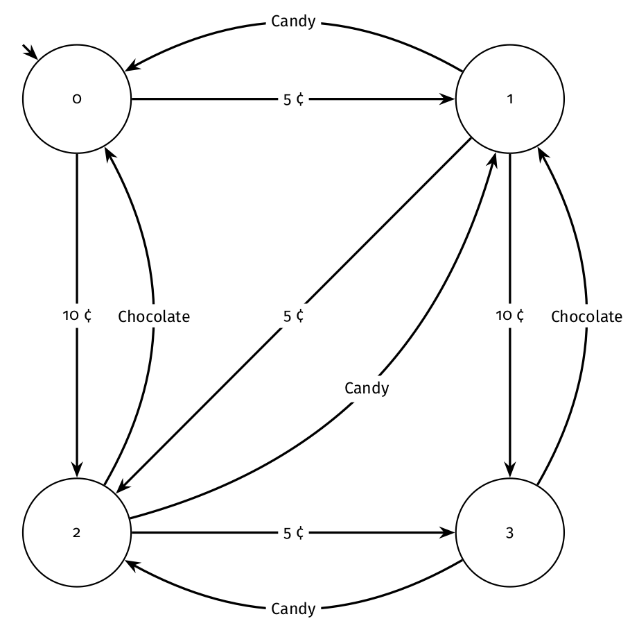

# Project 7: Vending Machine

>[!IMPORTANT]
> **Due**: 9/5/2024 at 2359
> 
> **Points**: 30 public, 50 semipublic, 20 secret

## Project Files

- Rust Files
  - *src/lib.rs*: This file describes the structure of the Rust library you are
    making. You should not modify it.
  - *src/evaluator.rs*: This file contains the functions you must implement for
    part 2.
  - *tests/public/*: These are the public tests. Feel free to write your own.

## Compilation and Tests

In order to compile the project, simply run `cargo build`. To test, run
`cargo test` in the root directory of the project. The tests won't run if any
part of the project does not compile. 

## Ground Rules

This is an individual assignment. You may use functions found in Rust's standard
library. You may write any helper functions that you wish. You may also use the [`regex` crate](https://docs.rs/regex/latest/regex/).
You may not use `unsafe`.

## Vending Machine

In this project, you will be doing the following: 
  1. Building a finite state machine representing a vending machine 
  2. Determining if a sequence of actions from a customer is valid 

Let's think about this in terms of an evaluator. The vending machine needs to
take the customer's order and payment, and then process it in order to
determine whether or not it should dispense the items. The vending machine 
should only successfully dispense the items if the customer has inserted enough 
money prior to ordering the item.

The evaluator will take in a customer's list of actions, and process these actions in 
order to determine whether or not the customer has paid enough money for the items they 
are vending. To do this, we're also going to need to know what the price of all of the 
vending machine's snacks are. This information will be stored in a hashmap, with the keys
being the names of the snacks and the values being their prices.

A vending machine is a prime example of a FSM. Edges are actions performed on the vending 
machine (which can be either inserting coins or vending items). States represent how much money
the user has inputted into the machine.

# Part (A): FSM Creation

### `pub fn create(price_map: &HashMap<Arc<str>, u32>) -> Fsm`

- **Description:** Takes in a HashMap that contains the price for each item in the
  vending machine. Creates and returns a finite state machine that represents
  all of the possible ways a customer could interact with the vending machine.

  In the FSM, each state represents an amount of money currently available to be used for purchases.
  The machine can only hold 500 cents. Each transition represents a customer action. Actions are:
    1) Inputting money (only 5-cent, 10-cent, and 25-cent coins are allowed)
    2) Ordering an item, which represents using up the cost of that item.

  You should have the minimal number of states needed to represent this. 

We will represent the FSM structure as the following:

```rust
/// A finite state machine representing the vending machine.
pub struct Fsm {
    /// (ID values can be whatever you want,
    /// as long as each ID uniquely identifies a state.)
    pub start: u32,

    /// A map representing possible transitions:
    /// (initial state, transition symbol) → final state.
    pub transitions: HashMap<(u32, VendingAction), u32>,
}
``` 

The `start` field stores the start state, and the `transitions` field stores the
list of transitions as a map. Unlike project 3, we don't expect you to
explicitly store the list of states or transition symbols. Also note that there
is no list of final states; *every* state mentioned in the transitions list is a
possible final state.

A `VendingAction` is defined in Part (B).

Suppose a vending machine has a maximum capacity of 15 cents. Additionally, the 
vending machine has some items: candy that costs 5 cents, and chocolate that costs 10 cents.

Here is a visual of what the FSM should look like for this vending machine:



This Fsm would look like the following:

```text
Fsm {
    start: 0
    transitions: [
        (0, insert 5) => 1, 
        (0, insert 10) => 2,
        (1, insert 10) => 3,
        (1, insert 5) => 2,
        (2, insert 5) => 3,
        (3, vend candy) => 2,
        (3, vend chocolate) => 1, 
        (2, vend candy) => 1, 
        (2, vend chocolate) => 0, 
        (1, vend candy) => 0 
    ]
}
```

If you inserted a 5-cent coin into this vending machine, you move to state 1 (the 5-cent state) 
and are able to vend candy. If you inserted a 10 cent coin after that, you move to state 3
(the 15-cent state), and can vend either candy or chocolate. If you then vend candy, you 
move to state 2 (the 10-cent state), since you are using up the cost for candy in the machine. 
If you then want to vend a second item, you can either get another piece of candy or a piece of chocolate.

> [!IMPORTANT]
> In the example shown above, the Fsm was limited to 15 cents. However, in your
> implementation of `create`, the FSM should be able to accept any combination of
> coins, and hold up to (but no more than) 500 cents.

> [!TIP]
> The data structures in [`std::collections`](https://doc.rust-lang.org/std/collections/index.html)
> may come in handy. (Or not; it's up to you!)

# Part (B): Evaluating Actions in a Vending Machine

### `pub fn eval(self: &Fsm, actions: &[VendingAction]) -> bool`

- **Description:** Takes in a finite state machine and the list of actions, and
  **uses the finite state machine to determine whether or not the actions are
  valid**. Returns `true` if the actions are all legal. Returns `false`
  otherwise. A customer is only able to insert one coin (nickel, dime, or quarter)
  at a time, and vend one item at a time. 

  Note that the finite state machine passed in may not necessarily be one that
  you have created above. 

We will represent the actions as a slice of the following:

```rust
/// An action that can be taken with respect to the vending machine:
/// insert money, or dispense an item.
pub enum VendingAction {
    /// Insert the specified number of cents into the machine.
    Insert(u32),
    /// Dispense an item from the machine.
    ///
    /// (An `Arc<str>` is a pointer to a string on the heap
    /// with reference-counting garbage collection.
    /// You can mostly treat it just like
    /// a `String`, except that it's immutable.
    /// Call the `.clone()` method to make a copy of it.)
    Vend(Arc<str>),
}
```

An `Insert` action means money was inserted into the Vending Machine, and a `Vend`
action means that the specified snack was attemped to be bought from the vending machine.

#### Examples

```rust
let actions = [
    VendingAction::Insert(5),
    VendingAction::Vend("candy".into()),
    VendingAction::Insert(10),
    VendingAction::Vend("chocolate".into()),
];
let mut prices = HashMap::new();
prices.insert("candy".into(), 5);
prices.insert("chocolate".into(), 10);

// Create Fsm with function from previous part
let fsm = Fsm::create(&prices);

assert_eq!(fsm.eval(actions), true);
```

With the FSM used in this example, the eval function with the current actions
list would evaluate to true. However, if the customer instead inserted 5 cents
and then vended chocolate, the eval function would evaluate to false because 5 cents is
not enough to buy chocolate. On the other hand, if the customer had inserted 10
cents, bought candy, inserted 5 more cents, and bought chocolate, the function
would evaluate to true because the customer had 5 cents leftover from buying
candy. Inserting 10 cents, 5 more cents, and then buying candy and chocolate
would also evaluate to true. Basically, there has to be enough money inserted
into the vending machine to buy a snack **before** the customer tries to buy the
snack.

## Academic Integrity

Please **carefully read** the academic honesty section of the course syllabus.
Academic dishonesty includes posting this project and its solution online like a
public github repo. **Any evidence** of impermissible cooperation on projects,
use of disallowed materials or resources, or unauthorized use of computer
accounts, **will be** submitted to the Student Honor Council, which could result
in an XF for the course, or suspension or expulsion from the University. Be sure
you understand what you are and what you are not permitted to do in regards to
academic integrity when it comes to project assignments. These policies apply to
all students, and the Student Honor Council does not consider lack of knowledge
of the policies to be a defense for violating them. Full information is found in
the course syllabus, which you should review before starting.
