# Exam 1 Review Session
## PL Concepts and OCaml Basics (20 mins)
* Syntax: what a program looks like
* Semantics: what a program means (what it computes)
  * Same syntax could have different meanings for different languages
  * Formal semantics–mathematical definition, such as operational semantics
* Paradigm
  * Fundamental differences
    * Recursion vs Looping
    * Mutation vs Functional Update
    * Manual vs Automatic Memory Management
  * Scripting/Dynamic
    * Higher-layer abstractions
  * Imperative/Functional is on the next section
  * Implementation
    * Compilation vs Interpretation
      * Compiler: source program translated to machine code then executed (gcc, javac)
      * Interpreter: executes each instruction one step at a time
  * Functional vs Imperative
    * Functional
      * Higher level of abstraction
#### Imperative vs Functional
  * Imperative - procedural, where building blocks are procedures and statements
  * Functional
    * immutability
      * Variables are never re-defined
      * New variable is a function of old ones
    * Higher-order
      * Functions are passed as arguments and returned as results
    * OCaml
      * pattern matching, module system, type inference (compile-time type checking)
#### OCaml Specific
  * Ocaml is a compiled and bootstrapped language
  * Implicitly typed --> the compiler infers the type of your variables and values at compile time
  * Statically typed --> once the type of a variable is inferred, the variable must abide by the type throughout its scope (type encforcement)
  * Primitive built-in data types
     * int, float, char, string, bool, and unit
     * Composite data types include tuples, lists, option, and variants
  * Arithmetic operators in Ocaml are not overloaded --> you can use +, -, *, / on two ints but not on floats
  * tuples - heterogenous, can have different types, can vary in length
  * lists - honmogeneous, can only have same times, can vary in length
   * `::` vs `@` -> `element :: [list of the type of the element]` vs `['a] @ ['a]`
   * There are also no statements in OCaml, everything is an expression, all expressions have values (expressions get evaluated to values), and all values have types. Even functions are expressions and those have their own types!!
  * Records vs Variants
   * Records and variants are both user defined types
    * Records generally used when for description
    * Variants generally used for polymorphism
#### More PL Concepts
 * Currying - transformation of a function that takes in multiple arguments to functions that take less arguments -> `let f a b = a + b in let g = f 5 in g 5;;` evaluates to 10
 * Shadowing - a variable is declared within a certain scope, then it shadows the variable declared outside of the scope with the same name
 * Side effects - operations that "do more" than just return a result (printing, file input, exceptions)

## OCaml Typing and Higher Order Functions (30 mins)


## Regular Expressions (30 mins)
* A pattern that describes a set of strings
* Defines a regular language, which can be created from a finite state machine.
* Creating regular expressions
  * [a-z] -> all ASCII characters from a to z (basically all lowercase letters)
  * [A-Z] -> all uppercase letters
  * [0-9] -> every digit from 0 to 9
    * as we can see, [r1-r2] is a range specification
      * Can ```[a-Z]``` represent a lowercase or an uppercase letter?    
  * (a|b) -> a **or** b
  * (cs|ece) -> capture "cs" **or** "ece"
    * what if we did "[cs|ece]" ?
      
* Regex operators
  * \* -> zero or more repetitions of the preceding character or group
  * \+ -> one or more repetitions of the preceding character or group
  * ? -> zero or one repetitions of the preceding character or group
  * \. ->  any character
  * \{n\} -> exactly n repetitions of the preceding character or group
  * \{m, n\} -> at least m and at most n repetitions of the preceding character or group
  * \{n,\} -> at least n repetitions of the preceding character or group}
  * r1|r2 -> r1 or r2
     * You do not have to memorize these, they are on the cheatsheet!
* Some examples
  *  Write a regular expression that accepts id: XXX-XX-XXXX codename: <codename> where each X represents a number (can be different numbers) and <codename> is a string **beginning with an uppercase letter** that may have additional uppercase **and/or** lowercase letters after it.
   
     For example, the following strings should be accepted:    
       - id: 669-98-3600 codename: Watch
       - id: 123-45-6789 codename: McGregor 
     The following strings should be rejected:        
       - id: 123456789 codename: Wrong
       - id: 987-65-4321 codename: nope
  * Write a regex that describes a subset of valid UMD emails. Emails take the form of a user’s directory ID followed by the @ symbol, followed by one of the following domain names: cs.umd.edu, terpmail.umd.edu, or just umd.edu.
    
     Additional constraints: 
       - A user’s directory ID can be length 0 to length 8 consisting of only alphanumeric (both upper and lowercase) characters.
       - A user’s directory ID may not start with an uppercase letter.
       - A user's directory ID must end with a digit.
         
* Regular Expressions in OCaml      
  * You need to include the re library. (https://ocaml.org/p/re/1.10.4/doc/Re/index.html)
    ```
    #require "re" (* only in utop *)
    let comp_re = Re.compile (Re.Posix.re "I am ([0-9]+) years old") in 
    let matched = Re.exec comp_re "I am 23 years old" in 
    print_string ("Age: " ^ (Re.Group.get matched 1))
    ```
## Finite State Machines, NFA-DFA (40 mins)
### GENERAL IMPORTANT POINTS 
 1) **Every NFA is a DFA but not every DFA is a NFA**
    - NFA’s have epsilon transitions which are not present in a DFA
 2) **It is not always going to be the case that we have to consume some form of a symbol when moving from one state to another**
 3) **Move and e-closure on a state will not always return the same result**

### WHAT ARE FSM’S 
1) **Anything that has some logic associated with it and has memory available for the purpose of storage is a Finite State Machine.**
2) **We can make use of regular expressions to represent a 5 set tuple which forms a finite state machine.**
    - **Set of all possible states**
    - **A starting state —> There can be only 1 starting state**
    - **A set of final or accepting states —> Must always be present and can potentially be multiple in number**
    - **A set of transitions —> (starting_state, alphabet, ending_state)**
    - **Alphabets —> represents set of all symbols in the regex**
### HOW CAN WE CLASSIFY FSM’S
**All FSM’s can be described to be either deterministic or non deterministic**
 - **DFA ( Deterministic Finite Automata )**
 - **NFA ( Nondeterministic Finite Automata )**

### HOW CAN WE DIFFERENTIATE BETWEEN A NFA AND DFA###
 - **There’s no ambiguity involved when moving from one state to another.**
 - **NFA’s have epsilon transitions**

### NFA VS DFA
 - **Due to ambiguity in the number of output possibilities it is very expensive for us to check for string acceptance in NFA’s.**
 - **It is easier to convert a regular expression to NFA and since NFA’s are condensed in comparison to DFA’s we can say they are space efficient.**

### ε-closure
 - **Function that returns us a set of all the states that we can visit from our current state just using the ε-transition.**
    - **This means that we can only move from one state to another using ε-transitions and no other symbol**
    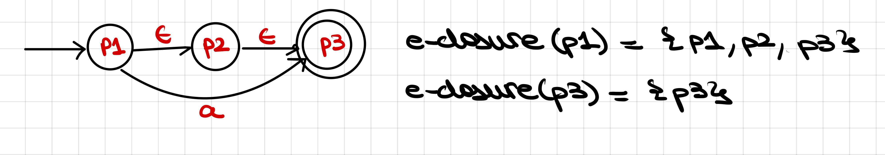

### move
 - **Function that returns us a set of all possible states which we can reach from our current state using the specified symbol**
    - **The move call is done only once unlike e-closure!**
    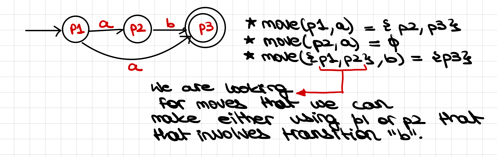

### REGEX TO NFA
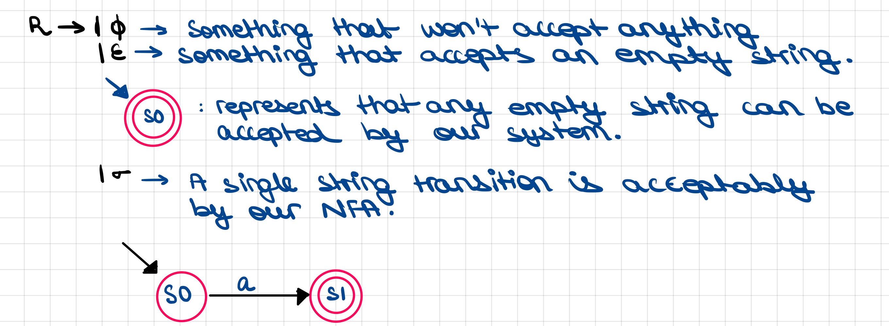
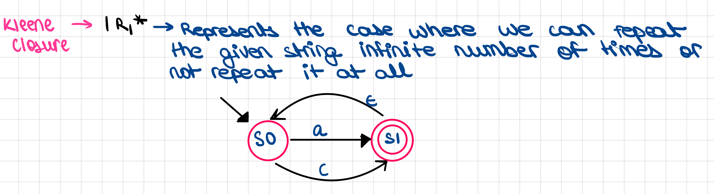
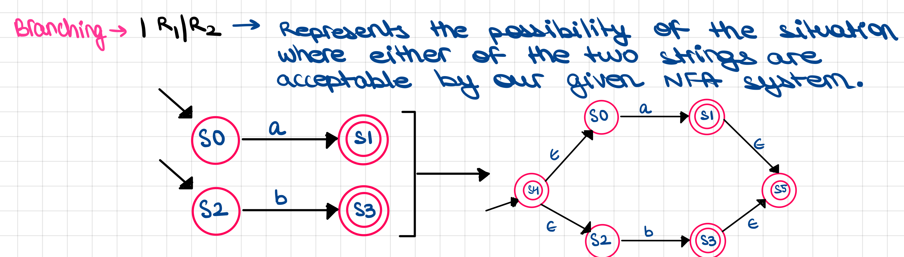

### NFA TO DFA
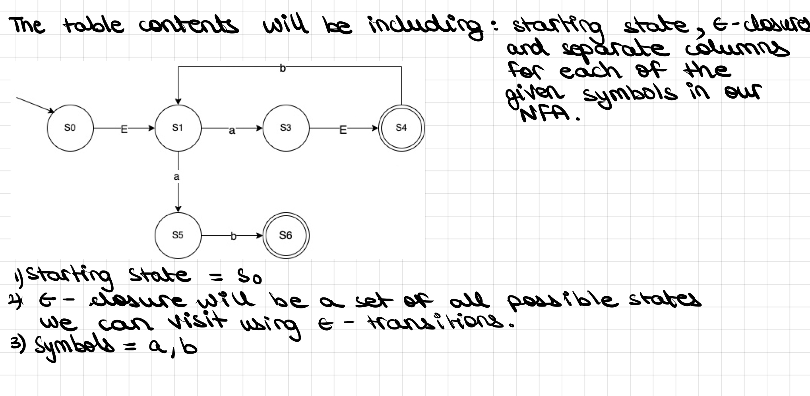

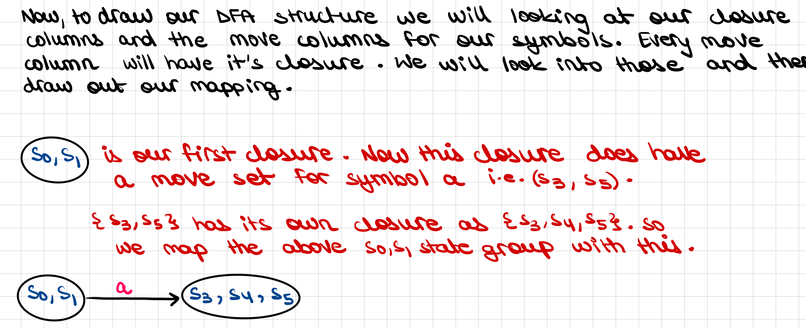

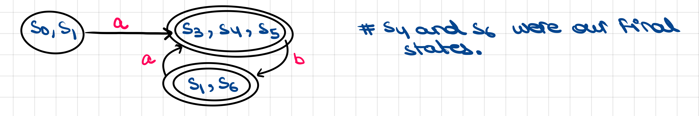

### PROBLEMS 
1)
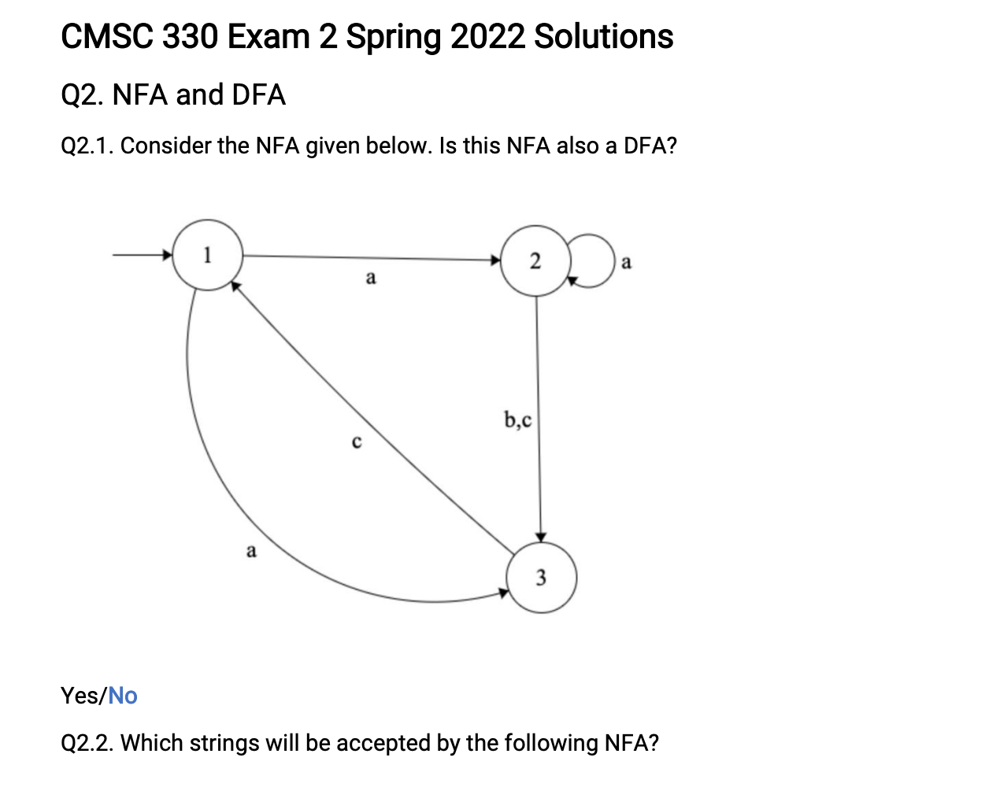

2)


3)


4) 
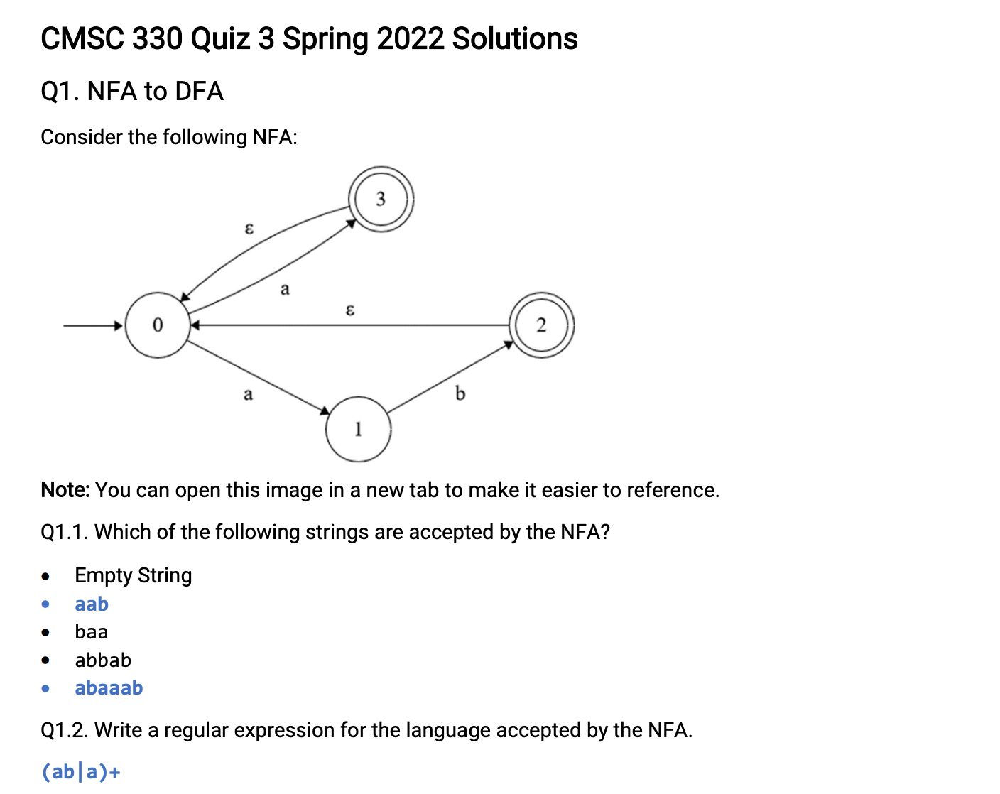

5)
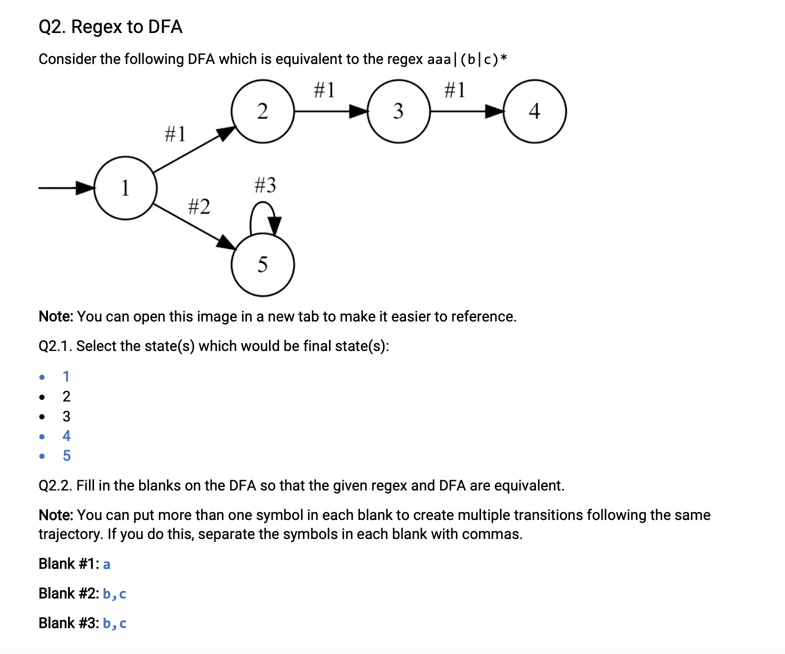

6)


7) Make this a regex to nfa problem
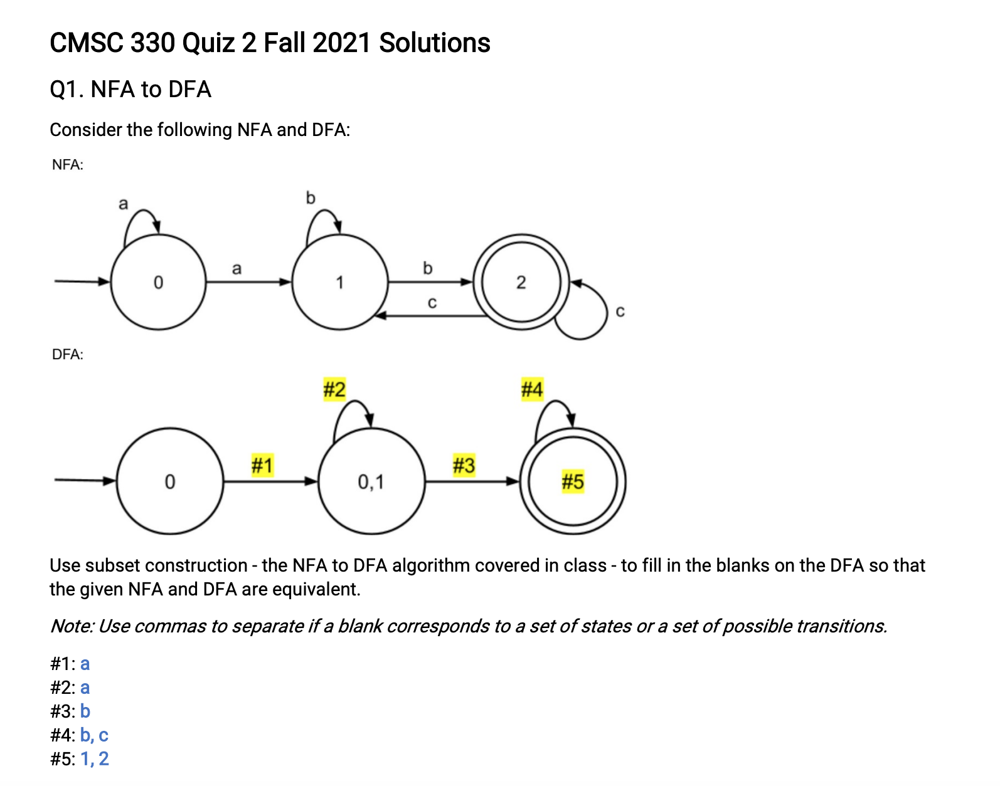

8) Make this a regex to nfa problem
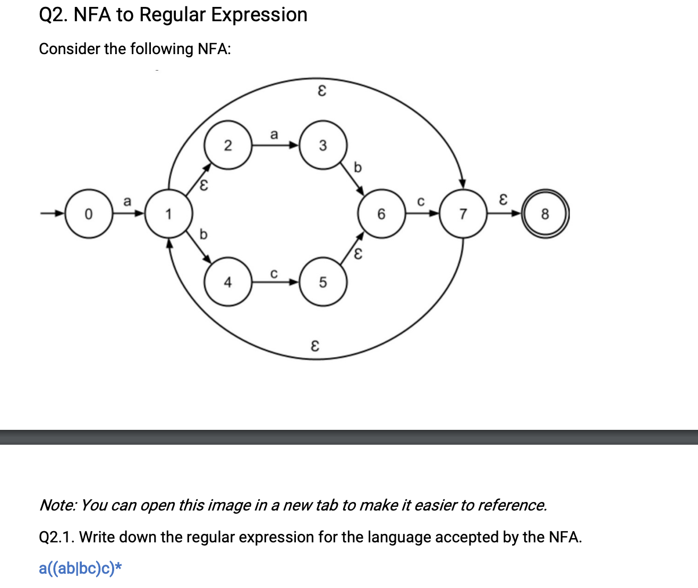

9) 

